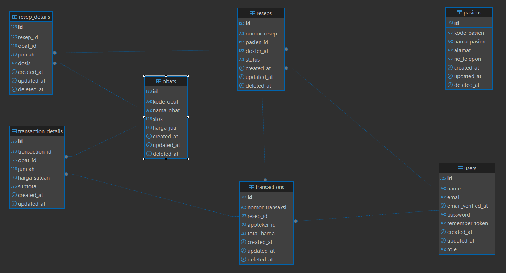

# 📘 Aplikasi Peresepan Dokter & Penjualan Obat — RS Anwar Medika (Mini Project 2025)

Aplikasi berbasis web untuk mengelola pembuatan resep oleh dokter dan penjualan obat oleh apoteker, sesuai ketentuan Mini Project Programmer RSAM 2025.

---

## 📌 Fitur Utama
### 👨‍⚕️ Role: Dokter
- Login
- Melihat daftar pasien (dummy)
- CRUD resep:
    - Memilih pasien
    - Memilih obat
    - Mengatur dosis & jumlah
- Melihat daftar resep pribadi
- Tidak dapat memproses resep
- Tidak dapat buat transaksi

### 💊 Role: Apoteker
- Login
- CRUD Master Obat (dummy)
- Melihat daftar resep dokter
- Memproses resep menjadi transaksi penjualan
- Melihat riwayat penjualan
- Tidak bisa membuat resep

---

## 🔁 Diagram Alur
```
┌──────────┐
│  Dokter  │
└─────┬────┘
      │
      ▼
┌──────────────────────────┐
│ Dokter membuat resep     │
│ Status: Draft            │
└─────┬────────────────────┘
      │
      ▼
┌──────────────────────────┐
│ Apoteker melihat daftar  │
│ resep berstatus Draft    │
└─────┬────────────────────┘
      │
      ▼
┌──────────────────────────┐
│ Apoteker memproses resep │
│ Status berubah: Diproses │
└─────┬────────────────────┘
      │
      ▼
┌──────────────────────────┐
│ Apoteker menyelesaikan   │
│ resep dan transaksi      │
│ Status: Complete         │
└──────────────────────────┘
```

---

## 🧩 ERD


---

## ⚙️ Teknologi yang Digunakan
- Laravel 10
- Laravel Breeze (Authentication)
- PostgreSQL
- TailwindCSS
- Blade

---

## 📦 Instalasi

### Clone Repository
```
git clone https://github.com/DhanyTama/peresepan-rsam.git
cd peresepan-rsam
```
### Install Dependency
```
composer install
npm install
```
### Copy & Generate Environment
```
cp .env.example .env
php artisan key:generate
```
### Sesuaikan Konfigurasi Database di `.env`
Contoh:
```
DB_CONNECTION=pgsql
DB_HOST=127.0.0.1
DB_PORT=5432
DB_DATABASE=peresepan-rsam
DB_USERNAME=postgres
DB_PASSWORD=
```

---

## ▶️ Cara Menjalankan Aplikasi

### 1. Jalankan Migration
```
php artisan migrate
```
### 2. Jalankan Seeder
```
php artisan db:seed
```
### 3. Jalankan Aplikasi
```
php artisan serve
npm run dev
```

---

## 🔑 Login Setiap Role
| Role   | Email                                           | Password |
| ------ | ----------------------------------------------- | -------- |
| Dokter | [dokter@example.com](mailto:dokter@example.com) | dokterpassword |
| Apoteker | [apoteker@example.com](mailto:apoteker@example.com) | apotekerpassword |


